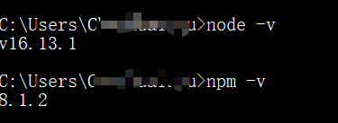

# appium
## 项目描述
1.以豆瓣app为例，测试登录、修改生日、屏幕滑动、图案解锁功能
2.测试h5页面打开
3.真机测试浏览器的打开
4.针对混合app（原生+h5）的测试

## 上手指南
下载代码，配置环境。
运行代码时，需要启动appium服务，并连接模拟器设备，否则代码运行会报错。

## 环境配置
1.配置java环境
2.Android SDK包下载，并配置环境变量
- 在系统变量中新增变量名：ANDRIOD_HOME,变量值为sdk的安装路径
- 在path中新增以下配置
```yaml
%ANDROID_HOME%\tools
%ANDROID_HOME%\platform-tools
%ANDROID_HOME%\build_tools
```
3.配置完成后，在cmd界面输入“adb” 和"appt"来判断安装是否成功
```yaml
adb命令
C:\Users\xxx>adb
Android Debug Bridge version 1.0.39
Revision 3db08f2c6889-android
Installed as E:\Andriod_sdk\platform-tools\adb.exeglobal options:-a         listen on all network interfaces, not just localhost-d         use USB device (error if multiple devices connected)-e         use TCP/IP device (error if multiple TCP/IP devices available)-s SERIALuse device with given serial number (overrides $ANDROID_SERIAL)-p PRODUCTname or path ('angler'/'out/target/product/angler');default $ANDROID_PRODUCT_OUT-H         name of adb server host [default=localhost]-P         port of adb server [default=5037]-L SOCKET  listen on given socket for adb server [default=tcp:localhost:5037]
aapt命令
C:\Users\xxx>aapt
Android Asset Packaging ToolUsage:aapt l[ist] [-v] [-a] file.{zip,jar,apk}List contents of Zip-compatible archive.aapt d[ump] [--values] [--include-meta-data] WHAT file.{apk} [asset [asset ...]]strings          Print the contents of the resource table string pool in the APK.badging          Print the label and icon for the app declared in APK.permissions      Print the permissions from the APK.resources        Print the resource table from the APK.configurations   Print the configurations in the APK.xmltree          Print the compiled xmls in the given assets.xmlstrings       Print the strings of the given compiled xml assets.
```
4.下载夜神模拟器，安装成功之后会默认启动一个模拟器
5.打开夜神多开器，点击底部“添加模拟器” 然后点击启用，可以打开第二个模拟器
6.appium环境搭建
1）安装Node.js(Node.js版本要注意与Appium兼容)
- 查看是否安装成功

- 如果显示‘npm’不是内部命令提示，则可以管理员省份运行cmd，如果还是失败，则需要检查一下环境变量是否配置，或者重新安装nodejs

2）appium安装
```yaml
镜像设置
npm install -g cnpm --registry=https://registry.npm.taobao.org
appium安装
npm install -g appium --registry=https://registry.npm.taobao.org
```
- 查看appium的安装路径的命令
```yaml
C:\Users\username>where appium
C:\Users\username\AppData\Roaming\npm\appium
C:\Users\username\AppData\Roaming\npm\appium.cmd
```
- appium 运行
```yaml
查看appium版本
appium -v
运行
appium
```
- 如果输入appium后显示：“appium不是内部或外部命令,也不是可运行的程序或批处理文件” 可以将appium安装的路径配置到系统环境变量Path中

3）安装Appium-desktop

4）安装Appium-Python-Client
```yaml
 pip install Appium-Python-Client
```
5)安装 appium-doctor
```yaml
cnpm install appium-doctor -g
```
## 主要内容
1.appium录制脚本

2.uiautomatorviewer定位元素

3.屏幕滑动功能实现

4.单个元素滑动

5.图案滑动

6.h5页面测试--uc-devtools定位元素

7.混合app（原生app+h5）测试